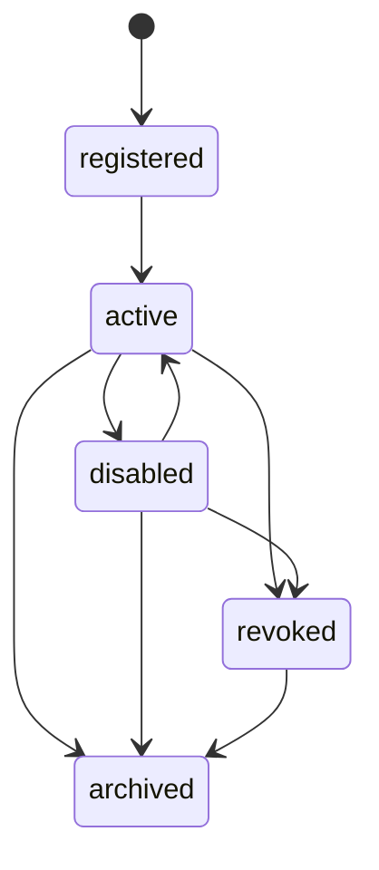

# Agent Lifecycle Policy

## 목적

Agent의 등록, 활성화, 비활성화, 키 폐기, 보관 정책을 정의한다.

Agent 상태는 작업 수행 가능 여부, API Key 사용 가능 여부, 사용량 조회, 과거 이력 보존에 영향을 준다.

## Agent 상태

| 상태 | 의미 | API Key 사용 | 신규 지침 할당 | 이력 조회 |
|---|---|---|---|---|
| `registered` | Agent가 등록되었으나 아직 활성 사용 전 | 제한적 | 불가 | 가능 |
| `active` | 정상 사용 가능 | 가능 | 가능 | 가능 |
| `disabled` | 일시 비활성화 | 불가 | 불가 | 가능 |
| `revoked` | 보안상 차단 또는 API Key 폐기 | 불가 | 불가 | 가능 |
| `archived` | 더 이상 사용하지 않지만 이력 보존 | 불가 | 불가 | 가능 |

## 상태 전이

## 상태별 정책

### `registered`

Agent가 생성되었지만 아직 운영에 투입되지 않은 상태이다.

정책:

- Agent ID를 발급한다.
- API Key를 발급할 수 있다.
- 신규 지침은 할당하지 않는다.
- 초기 capability 등록과 연결 테스트를 수행한다.

### `active`

정상 운영 상태이다.

정책:

- hook 수신 가능
- MCP 통신 가능
- heartbeat 수신 가능
- 신규 지침 할당 가능
- 사용량 집계 대상

### `disabled`

일시적으로 사용을 중단한 상태이다.

정책:

- API Key 인증을 거부한다.
- 신규 지침을 할당하지 않는다.
- 기존 이력은 조회 가능하다.
- 다시 `active`로 전환할 수 있다.

사용 예:

- 유지보수
- Agent 설정 변경
- 임시 장애 대응
- 사용자가 직접 비활성화

### `revoked`

보안상 차단된 상태이다.

정책:

- 모든 API Key를 즉시 무효화한다.
- hook, MCP, heartbeat 요청을 거부한다.
- 신규 지침을 할당하지 않는다.
- 다시 활성화하려면 새 API Key 발급과 관리자 확인이 필요하다.

사용 예:

- API Key 유출 의심
- 비정상 요청
- 권한 위반
- Agent 신뢰 불가

### `archived`

더 이상 사용하지 않는 Agent를 보관하는 상태이다.

정책:

- API Key 사용 불가
- 신규 지침 할당 불가
- 이력과 사용량은 조회 가능
- 기본 목록에서는 숨길 수 있다.
- 감사 목적의 기록은 유지한다.

## API Key와 Agent 상태

Agent 상태가 `active`가 아니면 API Key 인증은 실패한다.

예외:

- `registered` 상태에서 연결 테스트 전용 scope를 허용할 수 있다.

API Key 검증 시 확인 순서:

1. key 유효성
2. key revoked 여부
3. key 만료 여부
4. Agent 존재 여부
5. Agent 상태가 `active`인지 확인
6. scope 확인

## 사용량 기록

Agent가 `disabled`, `revoked`, `archived` 상태가 되어도 과거 사용량은 보존한다.

기록 대상:

- hook 호출 수
- MCP read/write 호출 수
- heartbeat 수
- snapshot 수
- lifecycle report 수
- test result 수
- 인증 실패 수
- 마지막 성공 호출 시각
- 마지막 실패 호출 시각

## 감사 로그

다음 변경은 감사 로그에 남긴다.

- Agent 등록
- Agent 활성화
- Agent 비활성화
- Agent 폐기
- Agent 보관
- API Key 발급
- API Key 폐기
- capability 변경

