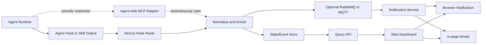

# 아키텍처 초안

## 전체 구조

## 구성요소

### Agent Hook 또는 Skill Output

각 에이전트가 hook, skill 실행 결과, 지침 처리 결과를 웹 계층으로 전달하는 접점이다.

필요 기술:

- HTTP 클라이언트
- 재시도 큐
- 이벤트 스키마 검증
- 로컬 버퍼링
- 인증 토큰 관리
- 지침 원문 또는 체크리스트 추출
- 테스트 결과 첨부

후보:

- Python SDK
- Node.js SDK
- 공통 HTTP hook API만 먼저 제공하고 SDK는 후속 구현

### MCP Endpoint and Adapter

MCP를 도입할 경우 Agent와 Next.js BFF 사이의 상호 연결성을 높이기 위한 endpoint와 어댑터이다.

역할:

- Agent capability 확인
- Agent heartbeat 확인
- Agent가 읽을 desired state 제공
- Agent가 기록한 actual state 수신
- 지침별 단계, 체크박스, 테스트 결과 스냅샷 동기화
- 최초 지시문과 전체 방향성에 대한 acknowledge 확인

주의:

- MCP adapter는 Agent를 강제로 제어하지 않는다.
- 명령은 직접 실행 요청이 아니라 Agent가 읽는 상태로 표현한다.
- 실제 수행 여부와 수행 시점은 Agent가 결정한다.
- 모든 lifecycle 보고를 MCP로 처리하지 않는다. 빈번한 진행 보고는 hook과 heartbeat로 처리한다.
- 서버 측 MCP endpoint는 Next.js BFF에 포함하는 것을 우선한다.
- Streamable HTTP 세션 처리 제약이 생기면 같은 배포 단위의 별도 Node MCP server로 분리한다.

### Next.js BFF/API

사용자 화면, hook 수신, MCP endpoint, 상태 조회, 알림 API를 담당하는 BFF 계층이다.

필요 기술:

- Next.js Route Handlers
- 인증과 권한 검증
- 이벤트 스키마 검증
- 멱등 키 처리
- 요청 제한
- SSE endpoint
- Web Push subscription endpoint

초기에는 Next.js BFF로 API 계층을 단일화한다. 장기 실행 worker와 알림 재시도는 별도 프로세스로 분리할 수 있다.

### Message Broker

수신된 상태 변화를 웹 내부의 알림 처리, 재시도 처리, 비동기 후처리로 분배하기 위한 선택적 메시지 계층이다.

후보:

- RabbitMQ: 알림 큐, 재시도, 라우팅, 작업 분배에 적합함
- MQTT: 경량 에이전트의 상태 송신, 연결 상태 추적, 토픽 기반 수신에 적합함

초기 단계에서는 HTTP hook 수신만으로 시작하고, 알림 실패 재시도나 내부 비동기 처리가 필요해질 때 RabbitMQ를 붙이는 방향이 현실적이다. MQTT는 에이전트 수가 많고 연결 상태 자체가 중요한 요구사항이 될 때 검토한다.

### State/Event Store

hook으로 받은 원본 이벤트, 정제된 상태, 지침별 단계, 체크박스, 테스트 결과, 최신 상태 스냅샷을 저장한다.

추가로 MCP 기반 간접 지시를 위해 desired state와 actual state를 분리해 저장한다.

- desired state: 웹 계층 또는 사용자가 기대하는 상태
- actual state: Agent가 보고한 실제 상태

높은 신뢰도 대상과 중간 신뢰도 대상을 구분해 저장한다.

- 높은 신뢰도: 최초 지시문, 지침 버전, 목표, 테스트 요구사항, 사용자 의도, acknowledge
- 중간 신뢰도: lifecycle report, heartbeat, 진행 단계, 최근 작업, 단순 기록 이벤트

후보:

- PostgreSQL: 관계형 조회, 권한 모델, 이력 조회에 유리함
- TimescaleDB: 시간 기반 이벤트가 많을 때 유리함
- Elasticsearch 또는 OpenSearch: 로그성 검색과 전문 검색이 중요할 때 검토

초기 기본값은 PostgreSQL이다.

### Query API

대시보드와 외부 시스템이 현재 상태, 타임라인, 통계를 조회하는 API이다.

필요 기능:

- 프로젝트별 상태 조회
- 지시별 타임라인 조회
- 에이전트별 최근 상태 조회
- 실패와 지연 필터
- 페이지네이션

### Display and Notification Fanout

정제된 상태 중 사용자에게 즉시 보여줄 필요가 있는 이벤트를 대시보드와 알림 시스템으로 전달한다.

제공 방식:

- Server-Sent Events: 서버에서 브라우저로 상태만 밀어줄 때 단순함
- WebSocket: 향후 양방향 상호작용이 필요할 때
- Browser Notification: 사용자가 페이지를 벗어나 있어도 중요 상태를 표시할 때
- In-page Modal: 현재 페이지 안에서 완료, 실패, 확인 필요 상태를 강조할 때
- Webhook: 외부 자동화 시스템 연동

초기 대시보드 목적이라면 Server-Sent Events와 페이지 내부 모달 알림이 단순하고 충분할 가능성이 높다. 브라우저 알림은 사용자 권한 동의가 필요하므로 선택 기능으로 둔다.

### Dashboard

운영자와 사용자에게 상태를 보여주는 화면이다.

주요 화면:

- 프로젝트 목록
- 프로젝트별 에이전트 상태
- 지시별 진행 타임라인
- 실패/지연 이벤트 목록
- 에이전트 상세
- 구독 설정

확정 기술:

- Next.js
- React

## 데이터 모델 초안

### projects

- `id`
- `name`
- `description`
- `owner`
- `created_at`
- `archived_at`

### agents

- `id`
- `project_id`
- `name`
- `type`
- `version`
- `capabilities`
- `status`
- `last_seen_at`
- `created_at`

### instructions

- `id`
- `project_id`
- `agent_id`
- `title`
- `requested_by`
- `status`
- `progress_percent`
- `current_stage`
- `stage_count`
- `completed_stage_count`
- `checklist_total`
- `checklist_done`
- `test_status`
- `desired_state`
- `actual_state`
- `instruction_version`
- `ack_status`
- `last_agent_ack_at`
- `last_snapshot_at`
- `created_at`
- `started_at`
- `completed_at`

### state_events

- `id`
- `project_id`
- `agent_id`
- `instruction_id`
- `event_type`
- `sequence`
- `occurred_at`
- `received_at`
- `progress`
- `stages`
- `checklist`
- `test_result`
- `message`
- `payload`
- `artifact_refs`
- `trace_id`
- `reliability_level`

### subscriptions

- `id`
- `subscriber_id`
- `project_id`
- `agent_filter`
- `instruction_filter`
- `event_filter`
- `delivery_type`
- `delivery_target`
- `created_at`
- `disabled_at`

## 핵심 설계 결정 후보

### 이벤트 중심 설계

상태를 직접 덮어쓰기보다 모든 상태 변화를 이벤트로 남긴다. 최신 상태는 이벤트를 바탕으로 별도 스냅샷으로 유지한다.

장점:

- 진행 이력 추적 가능
- 장애 원인 분석에 유리
- 나중에 새 구독자를 추가해도 과거 이벤트 재처리 가능

### 통합 상태 코드

에이전트마다 내부 상태 표현이 달라도 외부에는 공통 상태 코드로 노출한다.

예:

- `idle`
- `queued`
- `running`
- `waiting_input`
- `blocked`
- `completed`
- `failed`
- `cancelled`

### 상태와 로그 분리

모든 실행 로그를 상태 이벤트에 넣지 않는다. 상태 이벤트에는 요약과 참조만 넣고, 긴 로그는 별도 로그 저장소나 파일 참조로 관리한다.
