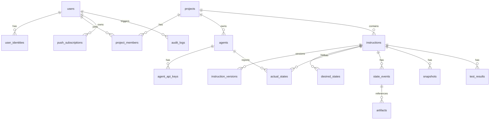

# 데이터 모델 초안

## 목적

현재까지 정의한 인증, Agent, 지침, 상태, 이벤트, 알림, 보존 정책을 구현하기 위한 데이터 모델 초안을 정리한다.

이 문서는 실 구현 전 확정안이 아니다. 구현 단계에서 실제 프레임워크, ORM, PostgreSQL 설계 기준에 맞춰 다시 검토한다.

## 테이블 목록

| 테이블 | 목적 |
|---|---|
| `users` | 사람 사용자 기본 정보 |
| `user_identities` | SSO provider와 사용자 매핑 |
| `projects` | 프로젝트 정보 |
| `project_members` | 프로젝트별 사용자 역할 |
| `agents` | Agent 기본 정보와 lifecycle 상태 |
| `agent_api_keys` | Agent/MCP/API Key 정보 |
| `api_key_usage` | API Key 사용량 집계 |
| `instructions` | 지침의 현재 대표 정보 |
| `instruction_versions` | 지침 버전별 원문과 변경 이력 |
| `desired_states` | 서버/사용자가 Agent에게 기대하는 상태 |
| `actual_states` | Agent가 보고한 최신 실제 상태 |
| `state_events` | 공통 envelope 기반 상태 이벤트 원본 |
| `heartbeats` | Agent heartbeat 이력 |
| `lifecycle_reports` | Agent lifecycle report 이력 |
| `snapshots` | 지침/단계/체크리스트 스냅샷 |
| `test_results` | 테스트 또는 검증 결과 |
| `artifacts` | 산출물 참조 |
| `notifications` | 알림 전송 이력 |
| `push_subscriptions` | 브라우저 Web Push subscription |
| `audit_logs` | 보안과 주요 변경 감사 로그 |

## 핵심 관계

## 주요 테이블 책임

### `users`

사람 사용자의 내부 계정이다.

주요 필드 후보:

- `id`
- `email`
- `display_name`
- `created_at`
- `disabled_at`

### `user_identities`

SSO provider와 내부 사용자를 연결한다.

주요 필드 후보:

- `id`
- `user_id`
- `provider`
- `provider_subject`
- `email`
- `created_at`

### `projects`

Agent와 지침을 묶는 단위이다.

주요 필드 후보:

- `id`
- `name`
- `description`
- `created_by`
- `created_at`
- `archived_at`

### `project_members`

프로젝트별 역할을 저장한다.

주요 필드 후보:

- `project_id`
- `user_id`
- `role`
- `created_at`

역할:

- `owner`
- `maintainer`
- `viewer`

### `agents`

Agent 기본 정보와 lifecycle 상태를 저장한다.

주요 필드 후보:

- `id`
- `project_id`
- `name`
- `type`
- `status`
- `capabilities`
- `last_heartbeat_at`
- `last_snapshot_at`
- `created_at`
- `archived_at`

상태:

- `registered`
- `active`
- `disabled`
- `revoked`
- `archived`

### `agent_api_keys`

Agent와 MCP/API client 인증 키를 저장한다.

주요 필드 후보:

- `id`
- `agent_id`
- `project_id`
- `key_id`
- `hashed_key`
- `scopes`
- `created_at`
- `expires_at`
- `last_used_at`
- `revoked_at`

원문 API Key는 저장하지 않는다.

### `api_key_usage`

API Key별 사용량을 집계한다.

주요 필드 후보:

- `key_id`
- `agent_id`
- `project_id`
- `hook_count`
- `mcp_read_count`
- `mcp_write_count`
- `heartbeat_count`
- `snapshot_count`
- `test_result_count`
- `auth_failure_count`
- `rate_limit_count`
- `last_success_at`
- `last_failure_at`

### `instructions`

지침의 현재 대표 상태를 저장한다.

주요 필드 후보:

- `id`
- `project_id`
- `agent_id`
- `current_version`
- `title`
- `status`
- `created_by`
- `created_at`
- `updated_at`
- `completed_at`

### `instruction_versions`

지침 버전별 원문과 변경 이력을 저장한다.

주요 필드 후보:

- `id`
- `instruction_id`
- `version`
- `body`
- `summary`
- `checklist`
- `test_requirements`
- `changed_by`
- `change_reason`
- `created_at`

### `desired_states`

사용자 또는 system이 Agent에게 기대하는 상태를 저장한다.

주요 필드 후보:

- `id`
- `instruction_id`
- `instruction_version`
- `desired_state`
- `requested_actions`
- `priority`
- `pause_requested`
- `cancel_requested`
- `retry_requested`
- `test_required`
- `report_required`
- `created_at`
- `updated_at`

### `actual_states`

Agent가 보고한 최신 실제 상태를 저장한다.

주요 필드 후보:

- `id`
- `agent_id`
- `instruction_id`
- `instruction_version`
- `actual_state`
- `ack_status`
- `current_stage`
- `checklist_done`
- `checklist_total`
- `test_status`
- `message`
- `last_heartbeat_at`
- `last_snapshot_at`
- `updated_at`

### `state_events`

공통 envelope 기반 원본 이벤트를 저장한다.

주요 필드 후보:

- `event_id`
- `event_type`
- `schema_version`
- `reliability_level`
- `source`
- `project_id`
- `agent_id`
- `instruction_id`
- `instruction_version`
- `sequence`
- `occurred_at`
- `received_at`
- `payload`

### `heartbeats`

Agent 생존 신호 이력을 저장한다.

주요 필드 후보:

- `id`
- `agent_id`
- `project_id`
- `instruction_id`
- `status`
- `occurred_at`
- `received_at`

### `lifecycle_reports`

Agent의 최근 작업 보고를 저장한다.

주요 필드 후보:

- `id`
- `agent_id`
- `instruction_id`
- `instruction_version`
- `actual_state`
- `current_stage`
- `last_action`
- `message`
- `occurred_at`
- `received_at`

### `snapshots`

지침과 진행 상태 전체 스냅샷을 저장한다.

주요 필드 후보:

- `id`
- `agent_id`
- `instruction_id`
- `instruction_version`
- `actual_state`
- `stages`
- `checklist`
- `artifacts`
- `test_status`
- `summary`
- `occurred_at`
- `received_at`

### `test_results`

테스트 또는 검증 결과를 저장한다.

주요 필드 후보:

- `id`
- `agent_id`
- `instruction_id`
- `instruction_version`
- `test_status`
- `test_command`
- `passed`
- `failed`
- `duration_ms`
- `summary`
- `report_ref`
- `occurred_at`
- `received_at`

### `notifications`

알림 전송 이력을 저장한다.

주요 필드 후보:

- `id`
- `user_id`
- `project_id`
- `instruction_id`
- `event_type`
- `channel`
- `status`
- `sent_at`
- `failed_at`
- `failure_reason`

### `push_subscriptions`

브라우저 Web Push subscription을 저장한다.

주요 필드 후보:

- `id`
- `user_id`
- `endpoint`
- `keys`
- `user_agent`
- `device_label`
- `created_at`
- `revoked_at`

### `audit_logs`

보안과 주요 변경 이력을 저장한다.

주요 필드 후보:

- `id`
- `actor_type`
- `actor_id`
- `project_id`
- `action`
- `target_type`
- `target_id`
- `metadata`
- `created_at`

## 구현 전 재검토 항목

- JSON 컬럼과 정규화 테이블의 경계
- instruction checklist를 JSON으로 둘지 별도 테이블로 분리할지
- state_events와 타입별 테이블의 중복 저장 범위
- actual_states를 instruction 기준으로 둘지 Agent 기준으로 둘지
- API Key hash 알고리즘
- 보존 정책에 따른 partition 또는 archive 필요 여부
- PostgreSQL index 설계

