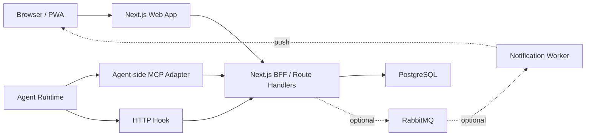

# 프레임워크 선정

## 확정 스택

MVP 기준 프레임워크와 인프라를 다음으로 확정한다.

| 영역 | 선정 |
|---|---|
| Web App | Next.js |
| UI Runtime | React |
| BFF/API | Next.js Route Handlers |
| MCP Endpoint | Next.js BFF 우선, 필요 시 별도 Node MCP server |
| Database | PostgreSQL |
| Agent 통신 | HTTP Hook + MCP Endpoint/Adapter |
| 실시간 화면 갱신 | Server-Sent Events |
| 알림 | Web Push + 페이지 내부 알림 |
| 배포 | Docker Compose |
| Reverse Proxy | 선택 사항 |
| 1차 선택 Queue | RabbitMQ |
| MQTT | 후순위 검토 |

## 핵심 결정

웹 계층은 Next.js BFF를 적극적으로 활용한다.

Next.js는 사용자 화면만 담당하지 않고, 다음 endpoint도 함께 담당한다.

- dashboard API
- hook endpoint
- heartbeat endpoint
- snapshot endpoint
- notification subscription endpoint
- SSE endpoint
- MCP endpoint

이렇게 하면 Web, API, MCP의 계층을 단일화할 수 있고, MVP 운영 복잡도를 낮출 수 있다.

보안상 외부에 공개되는 API/MCP endpoint도 BFF 계층만 사용한다. 내부 저장소, queue, worker, 분리된 MCP server가 생기더라도 외부에서 직접 접근하지 않는다.

## Next.js BFF

Next.js App Router와 Route Handlers를 사용한다.

역할:

- 사용자 화면 렌더링
- 사용자 인증과 권한 확인
- Agent hook 수신
- MCP endpoint 제공
- PostgreSQL 읽기/쓰기
- SSE 스트리밍
- Web Push subscription 관리
- 페이지 내부 알림용 상태 제공

인증:

- 사람 사용자는 SSO session cookie로 인증한다.
- Agent와 MCP client는 API Key로 인증한다.
- 모든 Route Handler는 공개 API로 보고 서버 측 권한 검사를 수행한다.

주의:

- Route Handler는 HTTP 요청 처리 계층으로 둔다.
- 상태 검증, 지침 버전 관리, 이벤트 저장 로직은 별도 service 모듈로 분리한다.
- 긴 작업, 알림 재시도, 대량 후처리는 요청 안에서 처리하지 않고 worker로 분리한다.
- MCP session state는 메모리에만 두지 않고 PostgreSQL 또는 Redis에 저장한다.

## MCP Endpoint

MCP server도 서버 배포에 포함한다.

기본 방향:

- 우선 Next.js BFF 안에 MCP endpoint를 둔다.
- Agent는 MCP Adapter를 통해 Next.js BFF의 MCP endpoint와 주기적으로 통신한다.
- 높은 신뢰도 영역인 최초 지시문, 전체 방향성, 지침 버전, acknowledge를 MCP로 다룬다.
- 진행 단계와 lifecycle report는 HTTP hook으로 보낸다.

분리 조건:

- Streamable HTTP transport 구현이 Next.js Route Handler와 맞지 않는다.
- MCP 연결 수가 늘어 별도 스케일링이 필요하다.
- MCP 세션 관리가 Web App 요청 처리와 분리되어야 한다.
- MCP endpoint가 장기 연결 또는 특수 Node HTTP API를 강하게 요구한다.

이 경우에도 별도 서비스가 아니라 같은 Docker Compose 배포 단위 안의 Node MCP server로 분리한다.

## PostgreSQL

상태 원장과 이력 저장소로 사용한다.

저장 대상:

- 사용자
- 프로젝트
- Agent
- 지침
- 지침 버전
- desired state
- actual state
- acknowledge
- state events
- lifecycle reports
- heartbeat
- checklist state
- test result
- notification history

## Server-Sent Events

대시보드 실시간 갱신에 사용한다.

선정 이유:

- 서버에서 브라우저로 상태를 밀어주는 단방향 흐름에 적합하다.
- WebSocket보다 단순하다.
- 현재 시스템은 브라우저에서 Agent를 직접 제어하지 않는다.

## RabbitMQ

초기 필수는 아니지만 1차 queue 후보로 확정한다.

도입 시점:

- 알림 재시도 필요
- notification worker 분리
- 이벤트 후처리 증가
- dead letter queue 필요

## MQTT

후순위 검토로 둔다.

도입 조건:

- Agent 수가 크게 늘어난다.
- Agent online/offline 자체가 핵심 기능이 된다.
- 경량 topic 기반 상태 송신이 필요하다.

## 확정 아키텍처

## MVP에서 제외

- Kubernetes
- Kafka
- MQTT
- 다중 region 구성
- native mobile app
- 필수 Reverse Proxy
- 필수 별도 backend service
- SSH 기반 Agent 제어
- Agent 프로세스 강제 제어

## Reverse Proxy 정책

Reverse Proxy는 MVP 필수 구성에서 제외한다.

도입 조건:

- HTTPS를 직접 운영해야 한다.
- 도메인을 붙여 외부 사용자에게 공개한다.
- Web App과 BFF/API를 같은 도메인 아래에서 라우팅한다.
- 인증, 압축, 요청 제한, 접근 로그를 프록시 계층에서 관리한다.
- 여러 서비스나 worker dashboard를 함께 노출한다.

후보:

- Caddy: HTTPS 자동화가 편하다.
- Nginx: 운영 경험과 레퍼런스가 많다.
- Traefik: Docker 기반 동적 라우팅에 편하다.

초기에는 Next.js BFF를 직접 실행하고, HTTPS와 공개 도메인이 필요해지는 시점에 운영측에서 Reverse Proxy를 추가한다.
