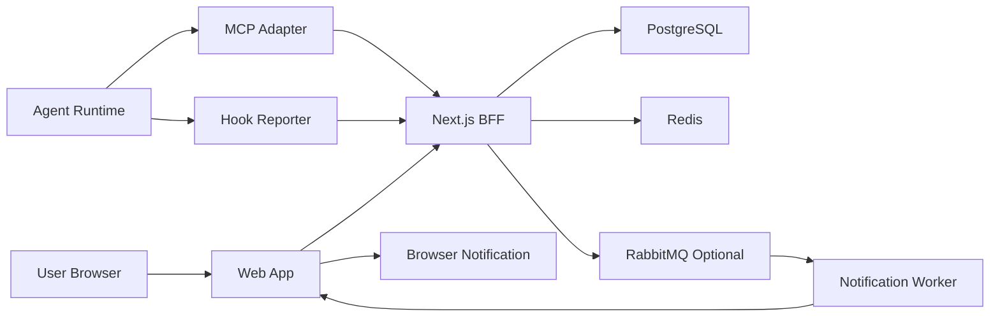
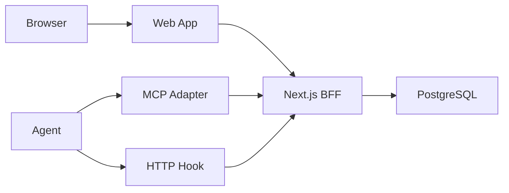

# 인프라 구성 초안

## 목적

Agent의 최초 지시 인지, 진행 단계 보고, heartbeat, lifecycle report, 테스트 완료 상태를 안정적으로 수집하고 사용자에게 표시하기 위한 인프라 구성을 정의한다.

이 시스템은 강제 원격 제어를 하지 않는다. 따라서 인프라의 핵심은 Agent를 직접 장악하는 것이 아니라, Agent가 주기적으로 상태를 읽고 쓰며 웹 계층이 이를 신뢰 가능한 기록으로 정리하는 것이다.

## 전체 구성

## 필수 인프라

### 1. Web App

사용자가 프로젝트, Agent, 지침, 진행 단계, 체크박스, 테스트 완료 여부를 확인하는 화면이다.

역할:

- 프로젝트별 상태 조회
- 지침별 진행 타임라인 표시
- 체크박스 진행률 표시
- Agent heartbeat와 stale/offline 상태 표시
- 페이지 내부 모달 알림 표시
- 브라우저 알림 권한 요청

후보:

- Next.js
- React SPA
- Vue 또는 SvelteKit

초기에는 단일 Web App으로 충분하다.

### 2. Next.js BFF/API

Hook 수신, MCP endpoint, 상태 조회, 알림 이벤트 생성을 담당한다.

역할:

- Agent 등록
- 지침 등록과 버전 관리
- desired state 저장
- actual state 수신
- hook event 수신
- heartbeat 수신
- lifecycle report 수신
- snapshot 수신
- 테스트 결과 수신
- 대시보드 조회 API 제공

구현:

- Next.js Route Handlers
- domain service 모듈
- PostgreSQL repository 모듈
- SSE endpoint
- Web Push subscription endpoint

초기에는 Next.js BFF 하나로 Web과 API 계층을 단일화한다. 알림 worker는 같은 코드베이스 안에서 별도 실행 프로세스로 분리할 수 있다.

### 3. PostgreSQL

신뢰 가능한 원장 역할을 하는 저장소이다.

저장 대상:

- 사용자
- 프로젝트
- Agent
- 지침
- 지침 버전
- desired state
- actual state
- state events
- lifecycle reports
- heartbeat
- checklist state
- test result
- notification history

PostgreSQL은 MVP의 핵심 필수 구성이다.

### 4. MCP Endpoint와 Agent-side MCP Adapter

Agent와 Next.js BFF 사이에서 높은 신뢰도 영역을 다루는 연결 계층이다.

역할:

- Agent가 읽을 desired state 제공
- Agent의 acknowledge 기록
- instruction_version 확인
- capability 확인
- heartbeat 또는 snapshot 기록
- Agent가 현재 수행 중인 지침 버전 기록

구현 위치:

- 서버 측: Next.js Route Handler 기반 MCP endpoint 또는 같은 배포 단위의 별도 Node MCP server
- Agent 측: Agent 프로세스 안, sidecar 프로세스, 또는 supervisor 프로세스

초기에는 서버 MCP endpoint를 Next.js BFF에 포함하고, Agent 옆에 작은 adapter 프로세스를 두는 것이 가장 분리하기 쉽다. MCP transport 구현 제약이 생기면 서버 측 MCP만 별도 Node 프로세스로 분리한다.

### 5. Hook Reporter

Agent가 진행 단계와 lifecycle report를 보낼 때 사용하는 경량 보고 계층이다.

역할:

- 진행 단계 보고
- 직전 수행 작업 보고
- 체크박스 완료 보고
- 산출물 링크 보고
- 테스트 결과 보고
- 실패 또는 차단 사유 보고

구현 방식:

- Agent 내부 hook
- skill 실행 후 report 호출
- adapter가 Agent 로그를 읽어 report 생성

초기에는 HTTP hook 호출 방식이 가장 단순하다.

## 권장 인프라

### 6. Redis

짧은 TTL 상태, SSE 연결 관리, rate limit, 임시 캐시 용도로 사용한다.

용도:

- 최근 Agent 상태 캐시
- 대시보드 실시간 표시용 latest state
- SSE 연결 fanout 보조
- 중복 이벤트 임시 필터
- API rate limit

PostgreSQL만으로도 MVP는 가능하지만, 실시간 화면 갱신과 중복 방지 편의성을 위해 Redis를 두면 운영이 편해진다.

### 7. Notification Worker

중요 상태를 알림으로 변환하는 작업자이다.

알림 대상:

- 최종 완료
- 테스트 완료
- 실패
- 차단
- stale
- offline
- 사용자 확인 필요

알림 방식:

- 페이지 내부 모달 알림
- 브라우저 알림
- 추후 이메일 또는 메신저

초기에는 Next.js BFF 코드베이스 안의 job으로 시작하고, 알림량이 늘면 worker로 분리한다.

## 선택 인프라

### 8. RabbitMQ

알림 재시도, 비동기 작업 분리, 후처리 안정화가 필요할 때 도입한다.

적합한 경우:

- 브라우저 알림 외에 외부 알림 채널이 늘어난다.
- 알림 실패 재시도가 중요하다.
- 상태 이벤트 후처리 작업이 많아진다.
- 여러 worker가 이벤트를 나눠 처리해야 한다.

초기에는 필수가 아니다. MVP에서는 RabbitMQ 없이 시작하고, Notification Worker 분리 시점에 도입해도 된다.

### 9. MQTT Broker

Agent 수가 많거나 Agent 연결 상태 자체가 중요한 경우 도입을 검토한다.

적합한 경우:

- Agent가 자주 연결되고 끊긴다.
- 경량 런타임에서 상태를 자주 보낸다.
- topic 기반으로 Agent 상태를 보고 싶다.
- Agent online/offline 감지가 중요한 기능이 된다.

현재 범위에서는 RabbitMQ보다 후순위이다.

### 10. Object Storage

Agent 산출물, 긴 로그, 테스트 리포트 파일을 보관할 때 사용한다.

후보:

- S3 호환 스토리지
- MinIO
- 로컬 파일 스토리지

초기에는 파일 링크나 짧은 텍스트 결과만 저장하고, 산출물이 커질 때 도입한다.

## MVP 구성

초기 구현은 다음 정도면 충분하다.

MVP 필수:

- Web App
- Next.js BFF/API
- PostgreSQL
- Server-side MCP endpoint
- Agent-side MCP Adapter
- HTTP Hook endpoint
- heartbeat endpoint
- snapshot endpoint
- 페이지 내부 알림
- Web Push 준비

MVP에서는 RabbitMQ, MQTT, Object Storage를 필수로 두지 않는다.

## 1차 확장 구성

알림과 실시간 표시 안정성이 필요해지면 다음을 추가한다.

- Redis
- Notification Worker
- Server-Sent Events
- 브라우저 알림
- 페이지 내부 모달 알림

## 2차 확장 구성

이벤트 후처리, 알림 재시도, 다중 worker가 필요해지면 다음을 추가한다.

- RabbitMQ
- worker process
- dead letter queue
- notification retry policy

Agent 연결 상태가 더 중요해지면 다음을 검토한다.

- MQTT Broker
- Agent topic naming
- retained message
- last will message

## 네트워크 구성

### 외부 공개

외부 사용자가 접근해야 하는 배포에서는 Web App과 BFF/API를 HTTPS로 노출하는 것이 바람직하다. 다만 MVP와 개인용 초기 운영에서는 Reverse Proxy와 HTTPS를 필수로 두지 않고, 필요 시 운영측에서 추가한다.

필요 시 추가:

- TLS 인증서
- 도메인
- reverse proxy
- API 인증
- browser notification permission 처리

후보:

- Nginx
- Caddy
- Traefik

초기 구성:

- 로컬 또는 제한된 환경에서는 Next.js BFF를 직접 실행한다.
- 외부 공개, PWA 알림, 브라우저 Push API의 안정적인 사용이 필요해지면 HTTPS를 추가한다.
- HTTPS 추가 시 Caddy, Nginx, Traefik 중 운영 편의에 맞춰 선택한다.

### Agent 통신

Agent는 Next.js BFF의 hook endpoint 또는 MCP endpoint에 outbound로 연결한다.

권장:

- Agent에서 서버로 outbound 연결
- 서버에서 Agent로 직접 inbound 접속하지 않음
- SSH 미사용
- Agent별 token 또는 client credential 사용

### 공개 경계

외부에 공개되는 서버 계층은 Next.js BFF로 제한한다.

외부 공개:

- Web Dashboard
- BFF API
- Hook endpoint
- MCP endpoint
- Web Push subscription endpoint

내부 전용:

- PostgreSQL
- Redis
- RabbitMQ
- Notification Worker
- 별도 Node MCP server를 분리하는 경우 해당 server

API와 MCP는 모두 BFF 계층을 통해서만 사용한다.

## 인증과 권한

### 사용자 인증

소수 외부 사용자 대상이므로 단순하지만 분리된 인증이 필요하다.

후보:

- 이메일 로그인
- OAuth
- magic link
- username/password + 2FA

### Agent 인증

Agent별 인증 토큰을 발급한다.

필수:

- agent_id
- agent_secret 또는 token
- token rotation
- revoked 상태
- project scope

### 권한 단위

- 사용자별 프로젝트 접근 권한
- Agent별 프로젝트 쓰기 권한
- 지침별 조회 권한
- 알림 구독 권한

### 확정 인증 방침

- 사람 사용자는 SSO로 인증한다.
- 사용자 세션은 JWT를 HttpOnly cookie로 감싸서 관리한다.
- Agent와 MCP/API client는 아이디/비밀번호가 아니라 API Key로 인증한다.
- API Key는 Agent별, project별, scope별로 발급한다.
- API Key 원문은 최초 발급 시 한 번만 보여주고 서버에는 hash만 저장한다.
- 모든 Route Handler는 공개 API로 보고 서버 측 인증과 권한 검사를 수행한다.

## 관측성

시스템 자체의 상태도 기록해야 한다.

필수 지표:

- hook 수신 수
- MCP heartbeat 지연
- Agent offline 수
- stale instruction 수
- failed instruction 수
- completed_and_tested 수
- notification 실패 수
- API 오류율

로그:

- API request log
- hook payload validation error
- Agent auth failure
- notification delivery result
- MCP adapter error

## 백업과 보존

### 백업

- PostgreSQL 정기 백업
- 설정 파일 백업
- Agent token 재발급 절차

### 보존 정책

- 최신 상태: 장기 보존
- state events: 일정 기간 보존
- lifecycle reports: 압축 또는 요약 후 보존
- 긴 로그와 산출물: 별도 보존 정책 적용

## 배포 형태

### 개인용 소규모 배포

권장:

- 단일 VPS
- Docker Compose
- PostgreSQL
- Next.js Web App/BFF
- MCP Adapter는 Agent 실행 환경에 별도 배포
- Reverse Proxy는 필요 시 추가

### 조금 더 안정적인 배포

권장:

- 필요 시 MCP server 별도 프로세스 분리
- PostgreSQL managed service
- Redis 추가
- reverse proxy
- backup 자동화
- worker 분리

## 초기 우선순위

1. PostgreSQL 스키마
2. Next.js BFF/API
3. HTTP Hook endpoint
4. MCP Adapter 최소 구현
5. heartbeat와 snapshot
6. Web Dashboard
7. 페이지 내부 모달 알림
8. 브라우저 알림
9. Redis
10. RabbitMQ
11. MQTT

## 확정 프레임워크

- Web App: Next.js
- UI Runtime: React
- BFF/API: Next.js Route Handlers
- Database: PostgreSQL
- 실시간 화면 갱신: Server-Sent Events
- Queue: RabbitMQ
- 모바일 웹 알림: PWA + Web Push
- Reverse Proxy: 선택 사항
