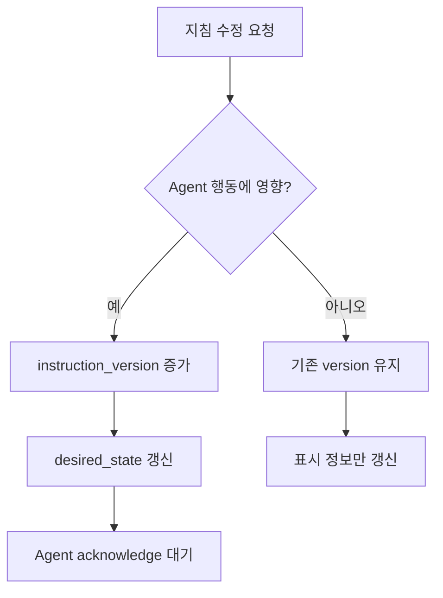

# 지침 버전 정책

## 목적

Agent가 어떤 지침을 인지하고 수행했는지 명확히 추적하기 위해 `instruction_version` 정책을 정의한다.

지침 버전은 완료 판정, 테스트 결과, acknowledge, stale 판정의 기준이 된다.

## 기본 정책

중요 변경만 새 버전을 생성한다.

오타, 설명 보강, 표시용 메모처럼 Agent의 수행 방향에 영향을 주지 않는 변경은 기존 버전을 유지한다. 목표, 수행 범위, 테스트 요구사항, 취소/재시도처럼 Agent의 행동에 영향을 주는 변경은 `instruction_version`을 증가시킨다.

## 버전 증가가 필요한 변경

| 변경 내용 | 버전 증가 |
|---|---|
| 목표 변경 | 예 |
| 수행 범위 변경 | 예 |
| 완료 조건 변경 | 예 |
| 테스트 요구사항 변경 | 예 |
| requested_actions 변경 | 예 |
| desired_state 변경 | 예 |
| 우선순위의 의미 있는 변경 | 예 |
| 취소 요청 | 예 |
| 재시도 요청 | 예 |
| Agent 할당 변경 | 예 |
| 체크리스트 항목 추가/삭제 | 예 |
| 체크리스트 의미 변경 | 예 |

## 버전 증가가 필요 없는 변경

| 변경 내용 | 버전 증가 |
|---|---|
| 오타 수정 | 아니오 |
| 설명 문장 보강 | 아니오 |
| 사용자 표시용 제목 변경 | 아니오 |
| 내부 메모 추가 | 아니오 |
| 태그 추가 | 아니오 |
| 산출물 링크 설명 수정 | 아니오 |
| 체크리스트 문구의 의미 없는 표현 수정 | 아니오 |

## 버전 생성 흐름

## Agent 처리

Agent는 MCP를 통해 desired state를 읽을 때 `instruction_version`을 반드시 확인한다.

처리 규칙:

- 새로운 `instruction_version`을 발견하면 `ack_report`를 보낸다.
- 수행 가능하면 `acknowledged`를 기록한다.
- 수행 불가능하면 `rejected`를 기록한다.
- 이전 버전을 수행 중이었다면 현재 작업을 계속할지 중단할지는 Agent 정책에 따른다.
- 오래된 버전의 완료 보고는 최종 완료 판정에 사용하지 않는다.

## 완료 판정과 버전

`completed_and_tested`는 같은 `instruction_version` 안에서만 판정한다.

필수 조건:

- 해당 버전에 대한 `acknowledged`
- 해당 버전에 대한 `completed`
- 해당 버전에 대한 성공한 `test_result`

버전이 다르면 완료와 테스트 결과를 조합하지 않는다.

## 취소와 재시도

### 취소

취소 요청은 Agent 행동에 영향을 주므로 버전을 증가시킨다.

- desired_state: `cancel`
- cancel_requested: `true`
- requested_actions: `["acknowledge"]`

Agent가 취소를 인지하면 actual state를 `cancelled`로 기록한다.

### 재시도

재시도 요청은 버전을 증가시킨다.

- desired_state: `retry`
- retry_requested: `true`
- requested_actions: `["acknowledge", "execute", "test", "report"]`

재시도는 이전 실패와 구분되어야 하므로 새 버전에서 추적한다.

## 감사 로그

버전 증가가 발생한 경우 다음 정보를 감사 로그에 남긴다.

- instruction_id
- previous_version
- new_version
- changed_by
- changed_at
- change_reason
- changed_fields

