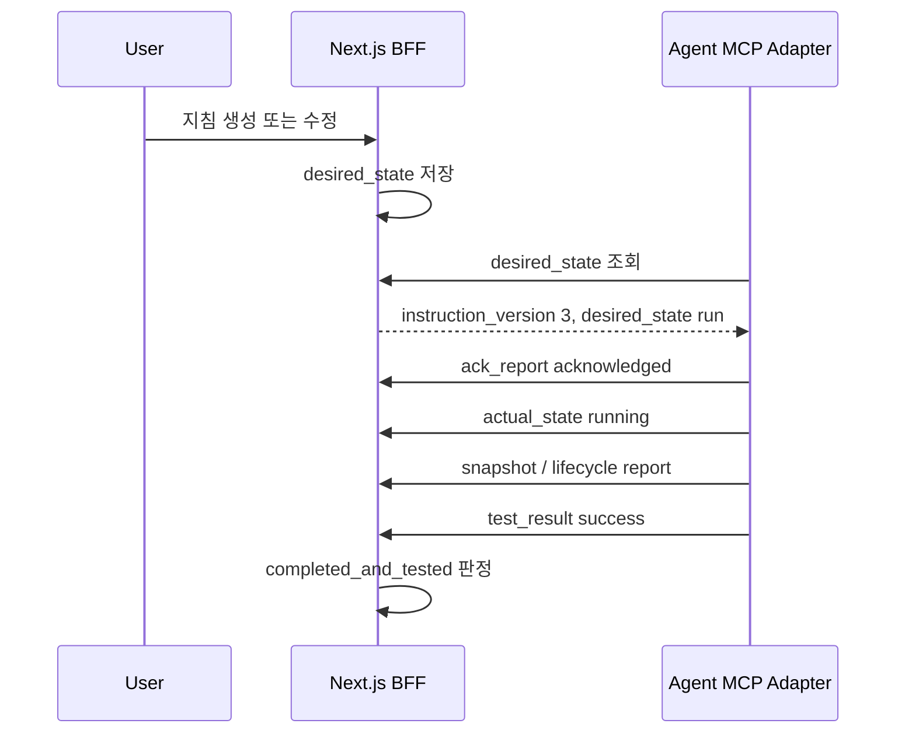

# MCP 상태 모델

## 목적

MCP를 통한 Agent 상호 연결에서 `desired_state`와 `actual_state`를 분리해 정의한다.

웹 계층은 Agent를 강제로 제어하지 않는다. 대신 Agent가 주기적으로 읽을 수 있는 desired state를 저장하고, Agent는 자신의 판단과 실행 결과를 actual state로 기록한다.

## 기본 개념

| 구분 | 의미 | 작성 주체 | 읽는 주체 |
|---|---|---|---|
| `desired_state` | 서버 또는 사용자가 Agent에게 기대하는 상태 | 사용자, system | Agent |
| `actual_state` | Agent가 실제로 인지하거나 수행 중인 상태 | Agent | 서버, 사용자 |

## Desired State

Agent가 읽는 상태이다.

### 필드

| 필드 | 타입 | 필수 | 설명 |
|---|---|---|---|
| `instruction_id` | string | 예 | 지침 ID |
| `instruction_version` | number | 예 | 지침 버전 |
| `desired_state` | string | 예 | 서버가 기대하는 상태 |
| `requested_actions` | string[] | 예 | Agent가 수행해야 할 행위 |
| `priority` | string | 선택 | `low`, `normal`, `high`, `urgent` |
| `pause_requested` | boolean | 예 | 일시정지 요청 여부 |
| `cancel_requested` | boolean | 예 | 취소 요청 여부 |
| `retry_requested` | boolean | 예 | 재시도 요청 여부 |
| `test_required` | boolean | 예 | 테스트 필요 여부 |
| `report_required` | boolean | 예 | 결과 보고 필요 여부 |
| `user_input_required` | boolean | 선택 | 사용자 입력 필요 여부 |
| `expires_at` | string | 선택 | 지침 유효 만료 시각 |
| `created_at` | string | 예 | desired state 생성 시각 |
| `updated_at` | string | 예 | desired state 변경 시각 |

### `desired_state` 값

| 값 | 의미 |
|---|---|
| `idle` | 수행할 지침 없음 |
| `run` | 지침 수행 요청 |
| `pause` | 일시정지 요청 |
| `cancel` | 취소 요청 |
| `retry` | 재시도 요청 |
| `hold` | 대기 요청 |

### `requested_actions` 값

| 값 | 의미 |
|---|---|
| `acknowledge` | 지침 버전 인지 보고 |
| `execute` | 지침 수행 |
| `test` | 테스트 또는 검증 수행 |
| `report` | 결과 보고 |
| `snapshot` | 현재 상태 스냅샷 보고 |
| `cleanup` | 정리 작업 |

### 예시

```json
{
  "instruction_id": "inst_001",
  "instruction_version": 3,
  "desired_state": "run",
  "requested_actions": ["acknowledge", "execute", "test", "report"],
  "priority": "normal",
  "pause_requested": false,
  "cancel_requested": false,
  "retry_requested": false,
  "test_required": true,
  "report_required": true,
  "created_at": "2026-06-07T10:00:00+09:00",
  "updated_at": "2026-06-07T10:00:00+09:00"
}
```

## Actual State

Agent가 쓰는 상태이다.

### 필드

| 필드 | 타입 | 필수 | 설명 |
|---|---|---|---|
| `agent_id` | string | 예 | Agent ID |
| `instruction_id` | string | 조건부 | 수행 중인 지침 ID |
| `instruction_version` | number | 조건부 | Agent가 인지한 지침 버전 |
| `actual_state` | string | 예 | Agent가 보고한 실제 상태 |
| `ack_status` | string | 선택 | 지침 인지 상태 |
| `current_stage` | string | 선택 | 현재 단계 |
| `last_action` | string | 선택 | 직전 수행 작업 |
| `checklist_done` | number | 선택 | 완료 체크 수 |
| `checklist_total` | number | 선택 | 전체 체크 수 |
| `test_status` | string | 선택 | 테스트 상태 |
| `message` | string | 선택 | 표시 가능한 요약 메시지 |
| `last_heartbeat_at` | string | 선택 | 마지막 heartbeat 시각 |
| `last_snapshot_at` | string | 선택 | 마지막 snapshot 시각 |
| `updated_at` | string | 예 | actual state 갱신 시각 |

### `actual_state` 값

`actual_state`는 [state-model.md](state-model.md)의 상태 코드를 사용한다.

주요 값:

- `acknowledged`
- `running`
- `waiting_input`
- `blocked`
- `completed`
- `tested`
- `failed`
- `cancelled`
- `rejected`

### `ack_status` 값

| 값 | 의미 |
|---|---|
| `unacknowledged` | 아직 지침을 읽지 않음 |
| `acknowledged` | 지침 버전을 읽고 인지함 |
| `rejected` | 지침 수행을 거부함 |
| `superseded` | 더 최신 지침 버전이 있어 이전 버전이 대체됨 |

### 예시

```json
{
  "agent_id": "agent_001",
  "instruction_id": "inst_001",
  "instruction_version": 3,
  "actual_state": "running",
  "ack_status": "acknowledged",
  "current_stage": "test",
  "last_action": "Ran unit tests",
  "checklist_done": 3,
  "checklist_total": 4,
  "test_status": "running",
  "message": "테스트를 실행 중입니다.",
  "last_heartbeat_at": "2026-06-07T10:05:00+09:00",
  "last_snapshot_at": "2026-06-07T10:05:00+09:00",
  "updated_at": "2026-06-07T10:05:00+09:00"
}
```

## 전이 흐름



## 충돌 처리

### Agent가 오래된 지침 버전을 수행하는 경우

- Agent의 `instruction_version`이 현재 desired state보다 낮으면 `superseded`로 표시한다.
- Agent에게 최신 desired state를 다시 읽도록 유도한다.
- 오래된 버전의 완료 보고는 최종 완료 판정에 사용하지 않는다.

### 취소 요청

- 사용자가 취소하면 desired state를 `cancel`로 변경한다.
- Agent가 이를 읽으면 `acknowledged` 후 `cancelled` actual state를 기록한다.
- Agent가 읽지 못한 상태에서는 `cancel_requested`로 표시한다.

### 재시도 요청

- 사용자가 재시도하면 desired state를 `retry`로 변경하고 instruction_version을 증가시킬 수 있다.
- 재시도는 Agent 행동에 영향을 주므로 새 instruction_version을 생성한다.

## 저장 원칙

- desired state와 actual state는 같은 테이블에 섞지 않는다.
- instruction_version을 모든 높은 신뢰도 상태에 포함한다.
- actual state는 최신 상태 스냅샷과 이력 이벤트를 모두 남긴다.
- MCP 세션 상태는 메모리에만 의존하지 않는다.
