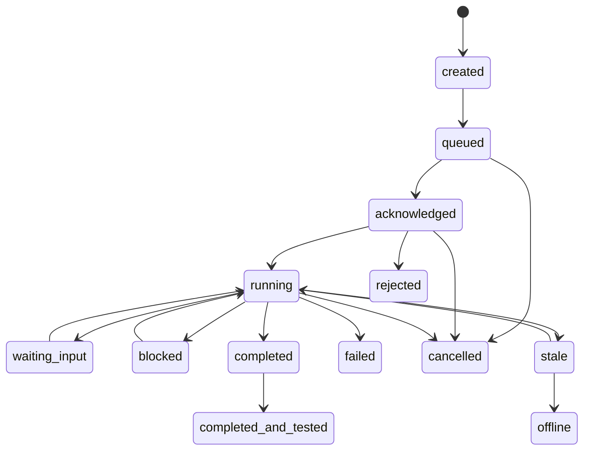

# 상태 모델

## 목적

Agent, 지침, 진행 단계, 테스트 결과를 공통 상태 코드로 표현한다.

상태 코드는 MVP에서 모두 사용하지 않더라도 향후 호환성을 위해 넉넉하게 정의한다. 각 상태는 어떤 입력 경로로 변경될 수 있는지 명확히 구분한다.

## 상태 변경 경로

| 경로 | 의미 |
|---|---|
| `user` | 사용자가 웹 화면에서 지침을 생성, 수정, 취소, 재시도 요청 |
| `mcp` | Agent가 MCP endpoint를 통해 desired state를 읽고 acknowledge 또는 actual state 기록 |
| `hook` | Agent가 hook/lifecycle report/test result로 상태 보고 |
| `timer` | heartbeat 또는 snapshot 지연을 기준으로 서버가 시간 기반 판정 |
| `system` | 서버 내부 검증, 정규화, 정책에 의해 상태 변경 |

## 상태 코드 표

| 상태 | 의미 | 주 변경 경로 | 보조 변경 경로 | 알림 기본값 | 비고 |
|---|---|---|---|---|---|
| `created` | 지침이 생성되었으나 아직 Agent에 할당되기 전 | `user` | `system` | 없음 | 사용자가 지침을 만들거나 외부에서 초안이 들어온 상태 |
| `queued` | 지침이 Agent에게 전달될 준비가 됨 | `system` | `user` | 없음 | desired state가 준비되었지만 Agent가 아직 읽지 않음 |
| `acknowledged` | Agent가 지침 또는 지침 버전을 읽고 인지함 | `mcp` | 없음 | 없음 | 높은 신뢰도 영역. instruction_version과 함께 기록 |
| `running` | Agent가 지침 수행을 시작함 | `mcp` | `hook` | 없음 | MCP actual state가 우선이며 hook 보고는 보조 기록 |
| `waiting_input` | 사용자 입력 또는 확인이 필요함 | `hook` | `mcp` | 모달 | Agent가 더 진행하려면 사용자 응답이 필요한 상태 |
| `blocked` | 외부 의존성, 권한, 반복 실패 등으로 진행이 막힘 | `hook` | `mcp`, `system` | 모달 + 푸시 | 사용자가 알아야 하는 중요 상태 |
| `stale` | 진행 중이지만 heartbeat 또는 snapshot 갱신이 늦음 | `timer` | `system` | 모달 | Agent가 죽었다고 확정하지 않고 지연으로 표시. 푸시는 보내지 않음 |
| `completed` | 작업 수행 또는 구현이 완료됨 | `hook` | `mcp` | 모달 | 테스트 완료와 구분 |
| `tested` | 테스트 또는 검증이 완료됨 | `hook` | `mcp` | 모달 | 단독 상태로 남기기보다 completed 여부와 조합 판단 |
| `completed_and_tested` | 작업 완료와 테스트 완료가 모두 확인됨 | `system` | `hook`, `mcp` | 모달 + 푸시 | 최종 성공 상태. 가장 중요한 완료 판정 |
| `failed` | 작업이 실패함 | `hook` | `mcp`, `system` | 모달 + 푸시 | 오류 원인과 재시도 가능 여부를 함께 기록 |
| `cancelled` | 사용자가 취소했거나 Agent가 취소를 반영함 | `user` | `mcp`, `system` | 모달 | desired state 취소 요청과 actual state 취소 반영을 구분 |
| `rejected` | Agent가 지침 수행을 거부함 | `mcp` | `hook` | 모달 | capability 부족, 정책 불일치, 권한 부족 등 |
| `offline` | Agent heartbeat가 임계 시간 이상 없음 | `timer` | `system` | 모달 | Agent 단위 상태. 푸시는 보내지 않음 |

## 상태 전이 기본 흐름

## Hook과 MCP의 책임 분리

### MCP가 우선인 상태

MCP는 높은 신뢰도 영역에 사용한다.

| 상태 | 이유 |
|---|---|
| `acknowledged` | Agent가 지침 버전을 읽었는지 확인해야 함 |
| `running` | Agent가 실제 수행을 수락했는지 확인해야 함 |
| `rejected` | Agent가 수행하지 않겠다는 명시적 의사 |
| `cancelled` | 취소 요청을 Agent가 인지했는지 확인해야 함 |

### Hook이 우선인 상태

Hook은 lifecycle 보고와 진행 결과에 사용한다.

| 상태 | 이유 |
|---|---|
| `waiting_input` | 작업 중 발견되는 사용자 입력 필요 상태 |
| `blocked` | 작업 중 발생한 차단 사유 보고 |
| `completed` | 수행 완료 보고 |
| `tested` | 테스트 결과 보고 |
| `failed` | 실행 실패 보고 |

### System/Timer가 우선인 상태

서버가 관찰 결과를 기준으로 판정한다.

| 상태 | 이유 |
|---|---|
| `created` | 지침 생성 시 서버 기록 |
| `queued` | desired state 준비 |
| `stale` | snapshot/heartbeat 지연 판정 |
| `offline` | heartbeat 장기 미수신 판정 |
| `completed_and_tested` | completed와 tested를 조합해 최종 성공 판정 |

## 상태별 주요 필드

| 상태 | 필수 또는 권장 필드 |
|---|---|
| `created` | `instruction_id`, `created_by`, `instruction_version` |
| `queued` | `desired_state`, `assigned_agent_id`, `instruction_version` |
| `acknowledged` | `agent_id`, `instruction_version`, `ack_at` |
| `running` | `agent_id`, `instruction_version`, `current_stage` |
| `waiting_input` | `message`, `question`, `requested_input_type` |
| `blocked` | `reason`, `blocking_dependency`, `retryable` |
| `stale` | `last_snapshot_at`, `stale_after_seconds` |
| `completed` | `completed_at`, `artifact_refs`, `summary` |
| `tested` | `test_status`, `test_result`, `tested_at` |
| `completed_and_tested` | `completed_at`, `tested_at`, `final_artifact_refs` |
| `failed` | `error_code`, `error_message`, `retryable` |
| `cancelled` | `cancel_requested_by`, `cancelled_at` |
| `rejected` | `reject_reason`, `capability_gap` |
| `offline` | `last_heartbeat_at`, `offline_after_seconds` |

## 완료 판정

`completed`만으로 최종 완료로 보지 않는다.

Agent 기준 최종 성공은 다음 조건을 만족할 때 `completed_and_tested`로 판정한다.

- 현재 instruction_version에 대해 `completed`가 보고됨
- 같은 instruction_version에 대해 테스트 결과가 보고됨
- 테스트 결과가 성공 또는 허용 가능한 상태임
- Agent가 다른 지침 버전으로 작업한 것이 아님
- Agent가 해당 instruction_version을 `acknowledged` 했음
- 현재 지침이 `failed`, `cancelled`, `rejected` 상태가 아님

사용자 최종 확인은 `completed_and_tested`의 필수 조건으로 두지 않는다. 필요할 경우 별도 확인 상태를 확장한다.
